# Trusted Render Pipeline — interactive demo

<p align="center">
  
</p>

A runnable, narrated walk-through of the use cases for `kcp render`
([SPEC §16](../../SPEC.md#16-trusted-render-pipeline-v016),
[RFC-0018](../../RFC-0018-Trusted-Render-Pipeline.md) /
[RFC-0019](../../RFC-0019-Unit-Content-Integrity-and-Origin-Evidence.md) /
[RFC-0022](../../RFC-0022-Composition-Integrity.md)).

The render pipeline's job is to turn an *untrusted* `knowledge.yaml` into a
deterministic, trust-tiered artifact, so that **a manifest may influence what an
agent knows, never what it does.** That guarantee is hard to feel from spec text.
This demo makes it concrete: each scenario frames a real-world use case, runs the
**actual shipping `kcp render`**, and shows what the output means.

## Run it

```bash
# one-time: build the CLI this demo drives
(cd ../../cli && npm install && npm run build)

# every scenario, narrated
node demo.js

# a single scenario
node demo.js relocation

# list scenario ids
node demo.js --list
```

Zero runtime dependencies — Node ≥ 20 stdlib only. The demo generates fresh
Ed25519 keys, writes throwaway fixtures under `.work/`, signs them, and invokes
`../../cli/dist/cli.js render`. There is one renderer: what you see is what ships.

## The scenarios

| Scenario | Threat | What it shows |
|----------|--------|---------------|
| `trusted` | — (happy path) | Org-signed, allowlisted, in-scope origin, intact `content_hash` → `tier: trusted`, unit `load_eligible: true`. |
| `unsigned` | — (unknown source) | Unsigned manifest from an unpinned origin → `tier: unsigned`; readable data, **not** auto-loaded. |
| `relocation` | **T9** | A genuine signed manifest shipped over attacker files behind a fabricated `.git` remote → `tier: known` (derived-evidence cap, C13) **and** `content_verified: mismatch` (C11) → `load_eligible: false`. |
| `stripping` | **T7** | An unsigned manifest claiming a *pinned* origin → `tier: failed`, non-zero exit, nothing emitted. Fails closed instead of degrading to `unsigned`. |
| `injection` | **T1** | A unit whose `intent` is written as a command → quarantined; the payload string never reaches the output. |
| `composition` | **T10** | A trusted, signed manifest that `composition.includes` an unauthenticated source → the included unit is `load_eligible: false` while local units stay `true` (C17). A signature over the composing file does not authenticate its includes. |

Each scenario maps to a conformance rule and to the executable validation corpus
in [`experiments/rfc-0018-render/`](../../experiments/rfc-0018-render/) — that
harness is the exhaustive pass/fail proof; this demo is the guided tour.

## The browser version

[`docs/render-simulator.html`](../../docs/render-simulator.html) replays these
scenarios as a clickable gallery. It does **not** reimplement the renderer — it
plays back captures produced here:

```bash
node demo.js --capture   # writes docs/js/render-captures.js
```

Because the page only replays authentic `kcp render` output, it cannot drift from
the implementation. Regenerate the captures whenever the renderer's output
changes.

## The animated cast (top of this README)

[`docs/render-cast.svg`](../../docs/render-cast.svg) is a pure-CSS animated
terminal that cycles through all six scenarios. It is generated from the same
captures — no recording tools, no rasterization, regenerable in-repo:

```bash
node demo.js --capture   # refresh docs/js/render-captures.js
node gen-cast.js         # rebuild docs/render-cast.svg from those captures
```

Like the simulator, it never reimplements the renderer — the frames are the real
output, so the cast can't drift either.
